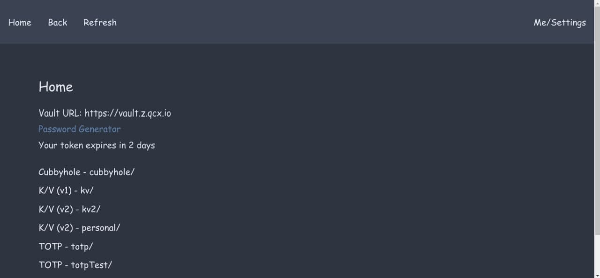
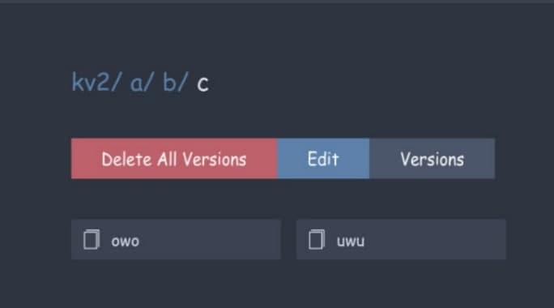

# VaultUI


This is a very simple UI for working with secrets in [Hashicorp Vault](https://www.hashicorp.com/products/vault)

## How to build:
```
npm install --save-dev
npx webpack
```
The resulting built files will be in `dist/`

## How to run in development:
Use whatever browser you want, I personally test on latest Microsoft Edge Dev build.
```
npm install --save-dev
WEBPACK_MODE=development BROWSER=google-chrome npx webpack serve
```

## Translating
Make sure to keep the order of comments and tags in the translation files `src/translations` the same.

When you want to PR an update, title it "Changed wording in..." or "Synced translations in de" or something along those lines.

To get a list of what languages need what translations added, run `node ./checkTranslations.mjs`
Example:
```
Language: fr
Missing:  unseal_input_btn, unseal_qr_btn
```
Means those two missing things need to be added to french.


f
## Screenshots
### Home

### Cubbyhole Engine

### K/V v1 Engine

### K/V v2 Engine



### TOTP Engine
We don't yet support `generate: true` TOTP secrets but probably will in the future.


### Transit Engine

